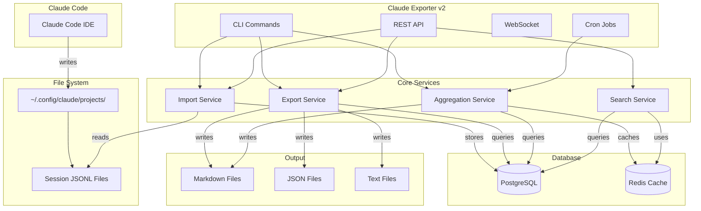
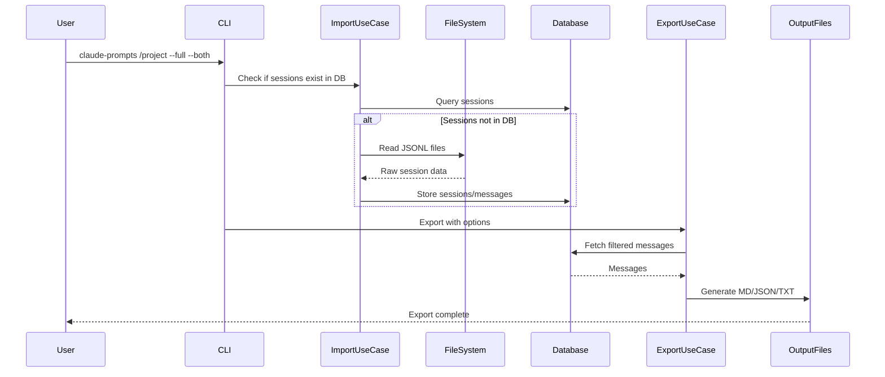
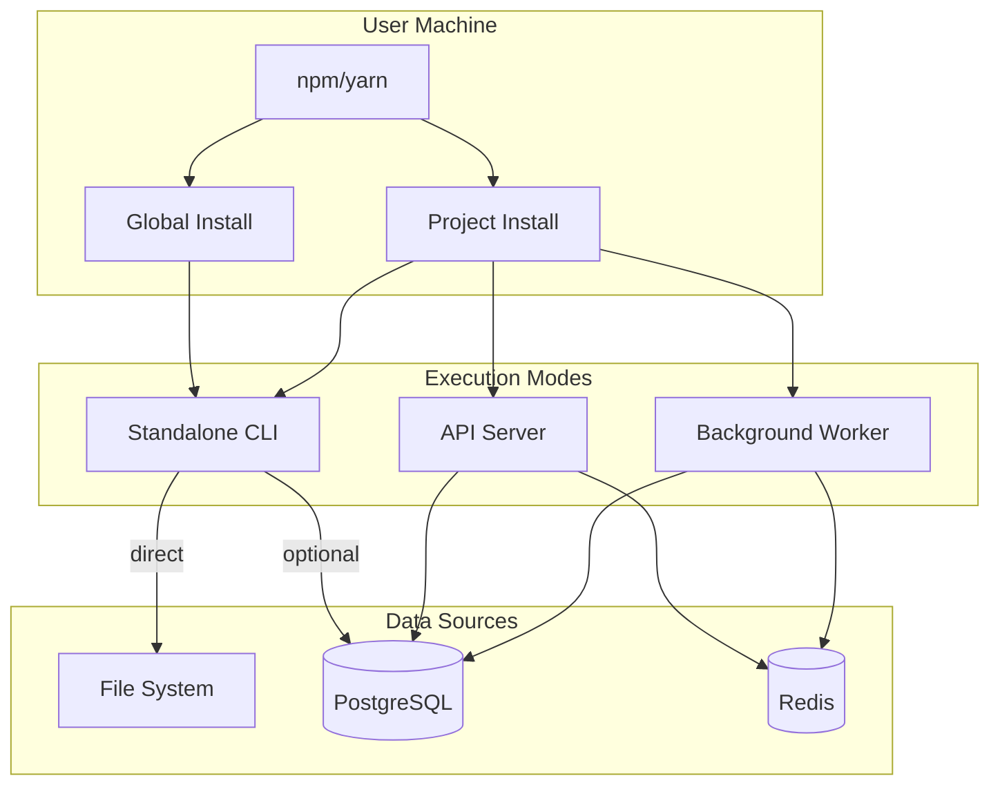
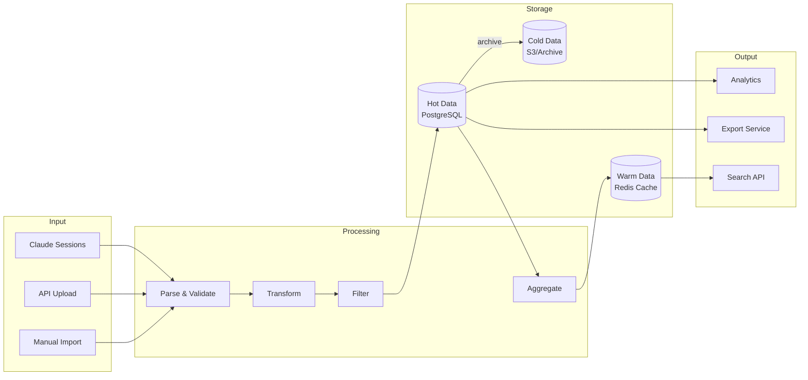
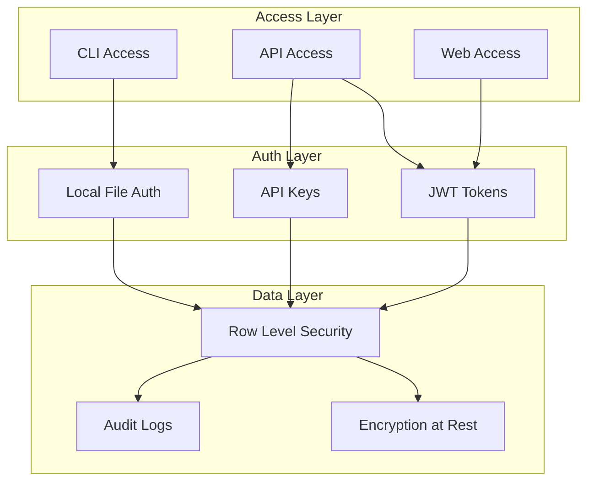
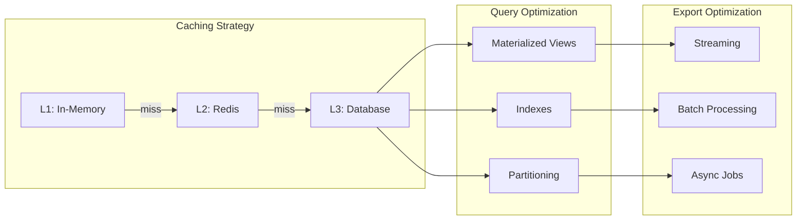
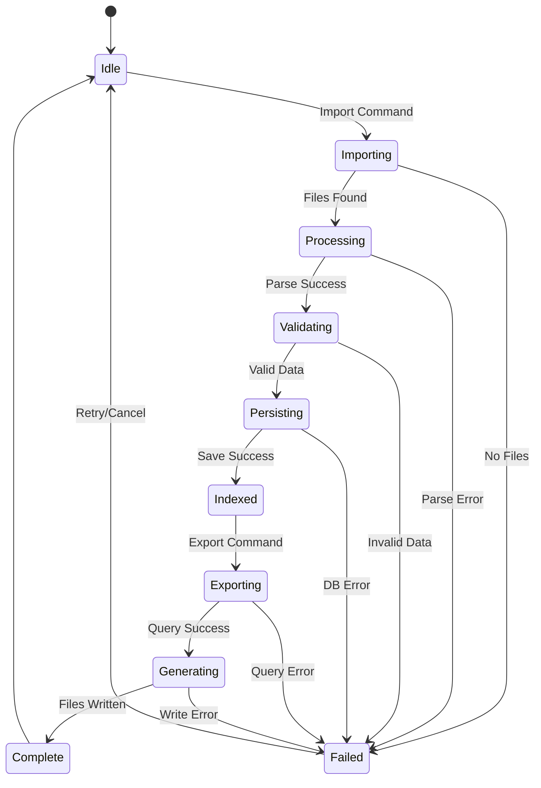
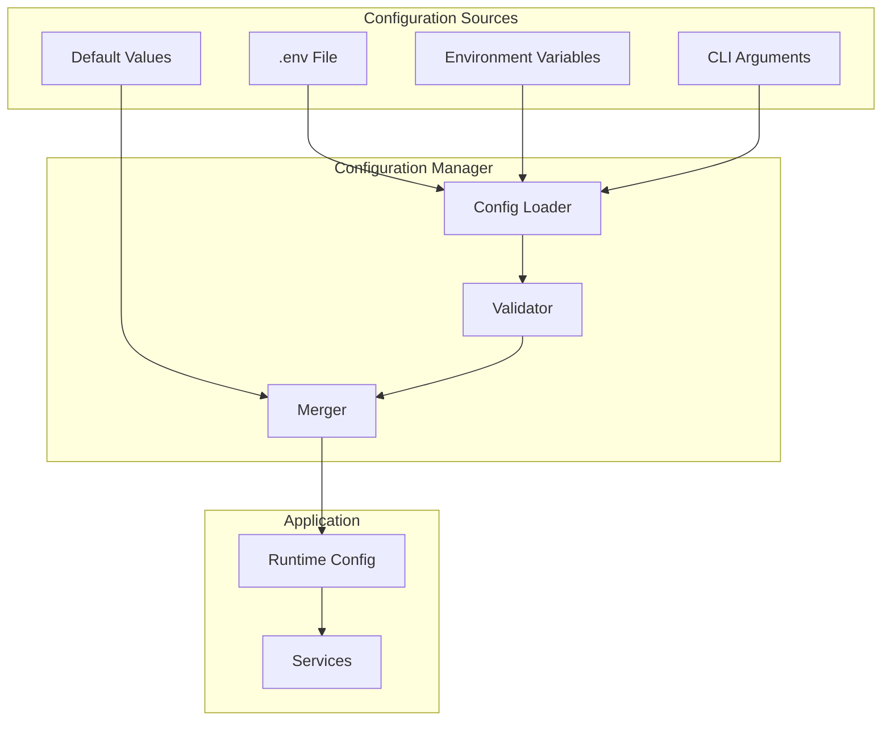

# 🏗️ Claude Code Exporter v2 - Architecture Overview

## 🎯 System Overview

## 📋 Component Interactions

## 🔄 Import Flow

```mermaid
flowchart LR
    subgraph "1. Discovery"
        FIND[Find Claude Home]
        ENCODE[Encode Project Path]
        SCAN[Scan JSONL Files]
    end
    
    subgraph "2. Parsing"
        READ[Read JSONL]
        PARSE[Parse Messages]
        EXTRACT[Extract Content]
    end
    
    subgraph "3. Domain"
        CREATE[Create Entities]
        VALIDATE[Validate Data]
        ENRICH[Enrich Metadata]
    end
    
    subgraph "4. Persistence"
        UPSERT[Upsert Project]
        SAVE[Save Session]
        BULK[Bulk Insert Messages]
    end
    
    FIND --> ENCODE --> SCAN
    SCAN --> READ --> PARSE --> EXTRACT
    EXTRACT --> CREATE --> VALIDATE --> ENRICH
    ENRICH --> UPSERT --> SAVE --> BULK
```

## 🚀 Deployment Architecture

## 📊 Data Pipeline

## 🔒 Security Model

## 📈 Performance Optimization

## 🎮 State Management

## 🔧 Configuration Flow

