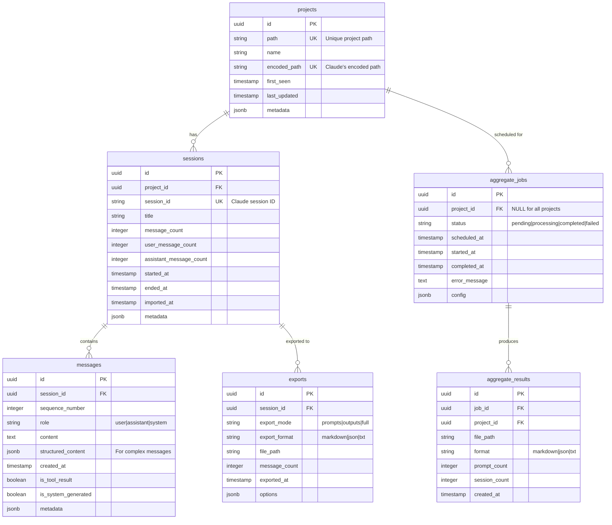
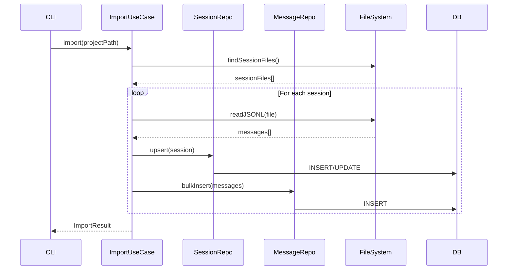
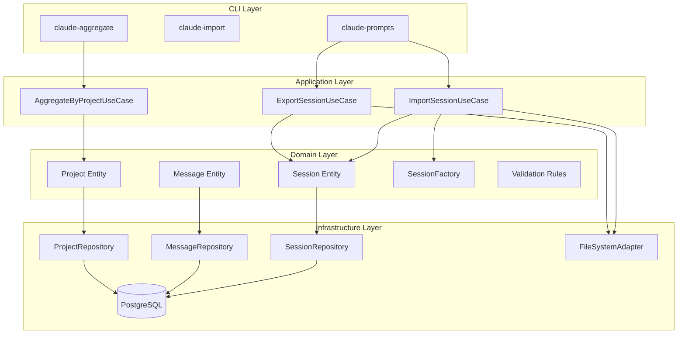
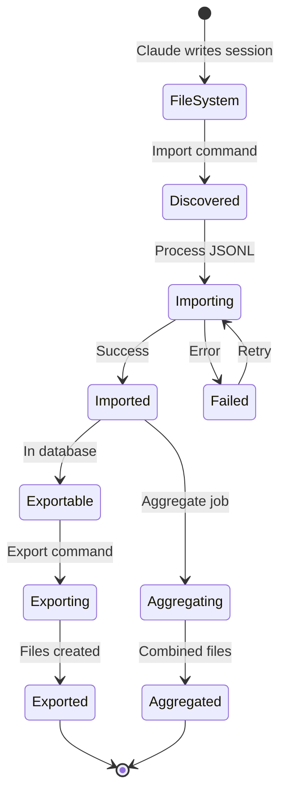

# 🗄️ Claude Exporter Database Design

## 📊 Entity Relationship Diagram



## 🔄 Data Flow Sequence



## 🏗️ Architecture Flow



## 📈 State Machine



## 🔑 Key Design Decisions

### 1. **UUID Primary Keys**
- Better for distributed systems
- No sequence bottlenecks
- Easier data migration

### 2. **JSONB Metadata Fields**
- Flexibility for future Claude format changes
- Store raw data without schema changes
- Enable advanced queries

### 3. **Separate Projects Table**
- Efficient aggregation queries
- Track project-level metrics
- Enable project-wide operations

### 4. **Async Job Processing**
- Non-blocking aggregation
- Schedulable operations
- Error recovery

### 5. **Structured Content Storage**
- `content`: Plain text for simple queries
- `structured_content`: Original format preservation
- Best of both worlds

## 🚀 Migration Strategy

```sql
-- 1. Create projects from existing sessions
INSERT INTO projects (path, name, encoded_path, first_seen, last_updated)
SELECT DISTINCT 
    decoded_path as path,
    basename(decoded_path) as name,
    encoded_path,
    MIN(created_at) as first_seen,
    MAX(updated_at) as last_updated
FROM (
    -- Decode paths from session files
) AS decoded_sessions
ON CONFLICT (path) DO UPDATE SET
    last_updated = EXCLUDED.last_updated;

-- 2. Link sessions to projects
UPDATE sessions s
SET project_id = p.id
FROM projects p
WHERE s.project_path = p.path;
```

## 🔍 Query Examples

### Get all prompts for a project
```sql
SELECT m.content, m.created_at, s.title
FROM messages m
JOIN sessions s ON m.session_id = s.id
JOIN projects p ON s.project_id = p.id
WHERE p.path = '/path/to/project'
  AND m.role = 'user'
  AND m.is_system_generated = false
ORDER BY m.created_at;
```

### Aggregate stats by project
```sql
SELECT 
    p.name,
    COUNT(DISTINCT s.id) as session_count,
    SUM(s.user_message_count) as total_prompts,
    MIN(s.started_at) as first_session,
    MAX(s.ended_at) as last_session
FROM projects p
JOIN sessions s ON p.id = s.project_id
GROUP BY p.id, p.name
ORDER BY total_prompts DESC;
```

## 🛡️ Security Considerations

1. **Row-Level Security**: Future multi-user support
2. **Encrypted Storage**: For sensitive prompts
3. **Audit Trail**: Track who exported what
4. **Data Retention**: Configurable cleanup policies