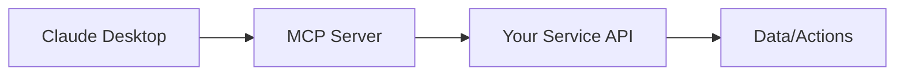

# GitHub Promotion Strategies for MCP Projects

This guide provides actionable strategies to promote your Model Context Protocol (MCP) projects on GitHub and gain visibility in the developer community.

## Table of Contents
- [README Best Practices](#readme-best-practices)
- [Getting Featured in Awesome Lists](#getting-featured-in-awesome-lists)
- [Social Media Promotion](#social-media-promotion)
- [Creating Demo Videos and GIFs](#creating-demo-videos-and-gifs)
- [Writing Blog Posts and Tutorials](#writing-blog-posts-and-tutorials)
- [Getting Stars and Engagement](#getting-stars-and-engagement)

## README Best Practices

### 1. Essential Components

#### **Project Title and Description**
- Use a clear, descriptive title that immediately conveys your MCP server's purpose
- Write a one-sentence description that explains what problem your MCP server solves
- Avoid generic titles like "My MCP Server" - be specific about functionality

#### **Problem Statement**
- Clearly articulate the **what**, **why**, and **how** of your project
- Example: "This MCP server connects Claude to your PostgreSQL database, enabling natural language queries without exposing credentials"

### 2. Structure Your README

```markdown
# MCP-[Service Name] Server

One-line description of what this MCP server does.

## 🚀 Features
- Feature 1 with benefit
- Feature 2 with benefit
- Feature 3 with benefit

## 📋 Prerequisites
- Node.js 18+ / Python 3.10+
- [Service] account/access
- Claude Desktop app

## 🔧 Installation
Step-by-step installation guide

## 💻 Usage
Clear examples with expected outputs

## 🤝 Contributing
How to contribute to the project

## 📝 License
License information
```

### 3. Visual Elements

#### **Badges**
Add relevant badges to build trust:
```markdown


```

#### **Demo GIF**
Include a demo GIF showing your MCP server in action with Claude Desktop

#### **Architecture Diagram**
Use Mermaid diagrams to explain how your MCP server works:
```markdown

```

### 4. MCP-Specific Documentation

- **Configuration Examples**: Show complete `claude_desktop_config.json` snippets
- **Available Tools**: List all tools/resources your server exposes
- **Error Handling**: Document common errors and solutions
- **Security Notes**: Explain how credentials are handled

## Getting Featured in Awesome Lists

### 1. Target MCP-Specific Lists

#### **Primary Targets**
- [awesome-mcp-servers](https://github.com/appcypher/awesome-mcp-servers)
- [wong2/awesome-mcp-servers](https://github.com/wong2/awesome-mcp-servers)
- [MCP Servers Directory](https://mcpservers.org/)

### 2. Submission Requirements

#### **Before Submitting**
- ✅ Ensure your project has been live for at least 30 days
- ✅ Add GitHub topics: `mcp`, `mcp-server`, `model-context-protocol`
- ✅ Include a clear description in your repository settings
- ✅ Have a valid license (MIT, Apache 2.0, etc.)
- ✅ Ensure your README follows best practices

#### **Submission Process**
1. Fork the awesome list repository
2. Add your project in the appropriate category
3. Follow the list's contribution guidelines
4. Submit a pull request with:
   - Brief description (one line)
   - Link to your repository
   - Any required badges or metadata

### 3. Increase Acceptance Chances

- **Unique Value**: Ensure your MCP server offers something not already on the list
- **Production Ready**: Have at least basic error handling and documentation
- **Active Maintenance**: Show recent commits and resolved issues
- **Community Engagement**: Have some stars, forks, or contributors

## Social Media Promotion

### 1. Twitter/X Strategy

#### **Initial Announcement**
```
🚀 Just launched MCP-[Service] Server!

Connect Claude Desktop to [Service] for:
✨ Feature 1
⚡ Feature 2
🔒 Feature 3

Built with the Model Context Protocol by @AnthropicAI

GitHub: [link]
#MCP #Claude #OpenSource #AI
```

#### **Follow-up Posts**
- Share specific use cases with screenshots
- Post tips and tricks for using your server
- Retweet/engage with MCP community posts
- Tag @AnthropicAI when relevant

### 2. Reddit Promotion

#### **Target Subreddits**
- r/LocalLLaMA
- r/ClaudeAI
- r/opensource
- Service-specific subreddits (e.g., r/PostgreSQL for database MCP)

#### **Post Template**
```
Title: I built an MCP server to connect Claude to [Service]

Hey everyone! I've been working on an open-source MCP server that lets you connect Claude Desktop to [Service].

Key features:
- Feature 1
- Feature 2  
- Feature 3

It's completely free and open source. Would love feedback from the community!

GitHub: [link]
Demo: [gif/video link]
```

### 3. Discord Communities

#### **MCP/AI Communities**
- Anthropic Discord (if available)
- LocalLLaMA Discord
- AI/ML community servers
- Service-specific Discord servers

#### **Engagement Strategy**
1. Join relevant channels (#showcase, #projects, #tools)
2. Share your project during appropriate times
3. Offer to help others implement similar solutions
4. Participate in discussions before promoting

## Creating Demo Videos and GIFs

### 1. Recommended Tools

#### **Screen Recording**
- **macOS**: Kap (free, open source)
- **Windows**: ScreenToGif (free, open source)
- **Linux**: Peek (free, open source)
- **Cross-platform**: OBS Studio

#### **Terminal Recording**
- Asciinema for terminal-based demos
- Can export to GIF or SVG animations

### 2. Demo Creation Process

#### **Planning Your Demo**
1. Keep it under 30 seconds
2. Show the most impressive feature first
3. Include clear on-screen actions
4. Add captions for key moments

#### **Recording Tips**
- Use a clean desktop background
- Close unnecessary applications
- Increase font size for readability
- Record at 24fps for smooth animations

#### **GIF Optimization**
```bash
# Using gifski for high quality
gifski -o output.gif input.mp4 --fps 10 --width 800

# Using ffmpeg for smaller size
ffmpeg -i input.mp4 -vf "fps=10,scale=800:-1" output.gif
```

### 3. Where to Host

- **GitHub**: Direct upload to README (max 10MB)
- **GitHub Releases**: For larger files
- **Imgur**: For easy embedding
- **GitHub Pages**: For multiple demos

## Writing Blog Posts and Tutorials

### 1. Blog Post Ideas

#### **Technical Deep Dives**
- "Building an MCP Server for [Service]: Architecture and Design Decisions"
- "Connecting Claude to [Service]: A Step-by-Step Tutorial"
- "5 Ways MCP Transformed My [Service] Workflow"

#### **Comparison Posts**
- "MCP vs Traditional API Integration: What's the Difference?"
- "Why I Chose MCP for My [Service] Integration"

### 2. Publishing Platforms

#### **Developer-Focused**
- **Dev.to**: Great for technical content, built-in audience
- **Hashnode**: Developer blogging platform
- **Medium**: Wider audience, technical publications

#### **Platform-Specific Tips**
- Use platform-native features (Dev.to liquid tags, Medium code blocks)
- Cross-post to multiple platforms
- Link back to your GitHub repository

### 3. Tutorial Structure

```markdown
# Building Your First MCP Server for [Service]

## Introduction
- What we're building
- Prerequisites
- Final result preview

## Step 1: Setting Up the Environment
[Detailed steps with code]

## Step 2: Creating the Basic Server
[Code examples with explanations]

## Step 3: Implementing [Service] Integration
[Show the interesting parts]

## Step 4: Testing with Claude Desktop
[Screenshots and examples]

## Conclusion
- What we learned
- Next steps
- Link to GitHub repo
```

## Getting Stars and Engagement

### 1. Initial Launch Strategy

#### **Week 1: Direct Outreach**
- Message 50-100 relevant connections
- Post in 5-10 relevant communities
- Submit to 3-5 awesome lists
- Create initial blog post

#### **Week 2-4: Content Creation**
- Daily tweets about features/updates
- Weekly blog posts or tutorials
- Respond to all issues and PRs
- Engage with MCP community

### 2. Growth Hacking Techniques

#### **GitHub-Specific**
- **Contribute to Related Projects**: Submit PRs to other MCP servers
- **Create Complementary Tools**: Build utilities that work with multiple MCP servers
- **GitHub Topics**: Use all 20 allowed topics strategically
- **Discussions**: Enable and actively use GitHub Discussions

#### **Community Building**
- **Office Hours**: Weekly sessions to help users
- **Video Tutorials**: YouTube walkthroughs
- **Template Repository**: Make it easy to fork and modify
- **Showcase Examples**: Real-world use cases

### 3. Metrics to Track

#### **GitHub Insights**
- Stars over time
- Traffic sources
- Popular content
- Clone statistics

#### **Engagement Metrics**
- Issue response time
- PR merge rate
- Discussion participation
- Fork-to-star ratio

### 4. Long-term Strategies

#### **Maintenance**
- Regular updates (monthly minimum)
- Quick issue responses (< 48 hours)
- Clear roadmap in GitHub Projects
- Automated testing and releases

#### **Community**
- Acknowledge contributors in README
- Create CONTRIBUTING.md guide
- Set up GitHub Sponsors if applicable
- Build integrations with other MCP servers

## Quick Action Checklist

### Launch Day
- [ ] Polish README with all sections
- [ ] Add demo GIF/video
- [ ] Set GitHub topics
- [ ] Create social preview image
- [ ] Write launch blog post

### Week 1
- [ ] Post on Twitter/X with hashtags
- [ ] Submit to 3 subreddits
- [ ] Share in 5 Discord servers
- [ ] Submit to awesome-mcp-servers
- [ ] Reach out to 50 contacts

### Month 1
- [ ] Write 4 blog posts/tutorials
- [ ] Create YouTube demo video
- [ ] Engage with 20 MCP projects
- [ ] Implement user feedback
- [ ] Update documentation

### Ongoing
- [ ] Weekly social media updates
- [ ] Monthly feature releases
- [ ] Respond to issues < 48hrs
- [ ] Participate in MCP community
- [ ] Track and optimize metrics

## Resources

### MCP-Specific
- [Model Context Protocol Docs](https://modelcontextprotocol.io)
- [MCP GitHub Organization](https://github.com/modelcontextprotocol)
- [Anthropic MCP Announcement](https://www.anthropic.com/news/model-context-protocol)

### Promotion Tools
- [GitHub Topics](https://github.com/topics)
- [Shields.io](https://shields.io) for badges
- [Carbon](https://carbon.now.sh) for code screenshots
- [Mermaid Live Editor](https://mermaid.live) for diagrams

### Analytics
- GitHub Insights (built-in)
- [GitHub Star History](https://star-history.com)
- Social media analytics
- Google Analytics for blog posts

Remember: Consistency and genuine value are key. Focus on building something useful, document it well, and engage authentically with the community. The stars and recognition will follow.