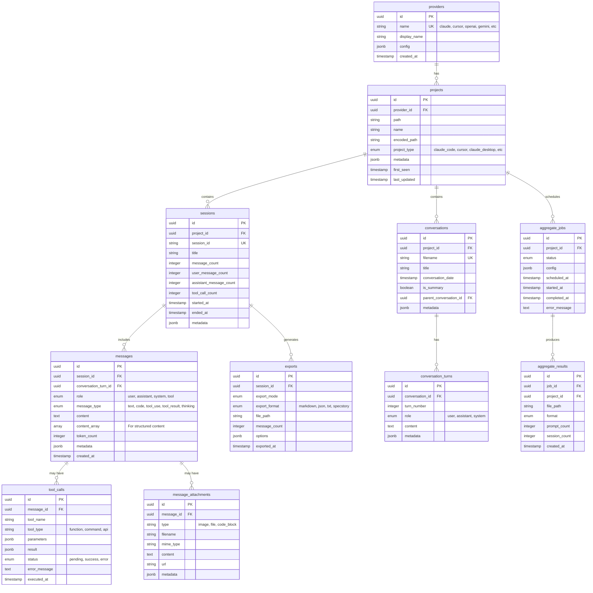

# 🏗️ Database v3 Design - Multi-Provider AI Export System

## 📊 Scalability Analysis (200x Data)

### Current State
- Projects: ~10 → 2,000
- Sessions: ~100 → 20,000
- Messages: ~10,000 → 2,000,000
- Tool calls: 0 → 500,000+

### Performance Considerations

#### 1. **Indexing Strategy**
```sql
-- Primary lookups
CREATE INDEX idx_messages_session_provider ON messages(session_id, provider_type);
CREATE INDEX idx_messages_created_at ON messages(created_at);
CREATE INDEX idx_messages_role_type ON messages(role, message_type);

-- Full-text search with GIN
CREATE INDEX idx_messages_content_gin ON messages USING gin(to_tsvector('english', content));

-- JSONB indexing for metadata and tool calls
CREATE INDEX idx_messages_metadata ON messages USING gin(metadata);
CREATE INDEX idx_tool_calls_params ON tool_calls USING gin(parameters);
```

#### 2. **Partitioning Strategy**
```sql
-- Partition messages by month for better performance
CREATE TABLE messages (
    id UUID DEFAULT uuid_generate_v4(),
    created_at TIMESTAMP NOT NULL,
    -- other columns
) PARTITION BY RANGE (created_at);

-- Auto-create monthly partitions
CREATE TABLE messages_2025_01 PARTITION OF messages
    FOR VALUES FROM ('2025-01-01') TO ('2025-02-01');
```

#### 3. **Query Optimization**
- Use materialized views for statistics
- Implement connection pooling
- Consider read replicas for analytics
- Archive old data to cold storage

## 🗄️ Enhanced Database Schema



## 🔧 Key Schema Features

### 1. **Multi-Provider Support**
```sql
CREATE TABLE providers (
    id UUID PRIMARY KEY DEFAULT uuid_generate_v4(),
    name VARCHAR(50) UNIQUE NOT NULL,
    display_name VARCHAR(100) NOT NULL,
    config JSONB DEFAULT '{}',
    created_at TIMESTAMP DEFAULT CURRENT_TIMESTAMP
);

-- Seed data
INSERT INTO providers (name, display_name) VALUES
    ('claude_code', 'Claude Code'),
    ('cursor', 'Cursor IDE'),
    ('claude_desktop', 'Claude Desktop'),
    ('openai', 'OpenAI/ChatGPT'),
    ('gemini', 'Google Gemini'),
    ('github_copilot', 'GitHub Copilot');
```

### 2. **Flexible Message Types**
```sql
CREATE TYPE message_type AS ENUM (
    'text',          -- Regular text message
    'code',          -- Code blocks
    'tool_use',      -- Tool invocation
    'tool_result',   -- Tool response
    'thinking',      -- Internal reasoning
    'system',        -- System messages
    'error'          -- Error messages
);

CREATE TABLE messages (
    id UUID PRIMARY KEY DEFAULT uuid_generate_v4(),
    session_id UUID REFERENCES sessions(id) ON DELETE CASCADE,
    conversation_turn_id UUID REFERENCES conversation_turns(id),
    role role_type NOT NULL,
    message_type message_type NOT NULL DEFAULT 'text',
    content TEXT,
    content_array JSONB, -- For Claude's structured content
    token_count INTEGER,
    metadata JSONB DEFAULT '{}',
    created_at TIMESTAMP NOT NULL,
    INDEX idx_msg_type (message_type),
    INDEX idx_msg_session_type (session_id, message_type)
);
```

### 3. **Tool Call Support**
```sql
CREATE TABLE tool_calls (
    id UUID PRIMARY KEY DEFAULT uuid_generate_v4(),
    message_id UUID REFERENCES messages(id) ON DELETE CASCADE,
    tool_name VARCHAR(100) NOT NULL,
    tool_type VARCHAR(50) NOT NULL,
    parameters JSONB,
    result JSONB,
    status VARCHAR(20) DEFAULT 'pending',
    error_message TEXT,
    executed_at TIMESTAMP,
    created_at TIMESTAMP DEFAULT CURRENT_TIMESTAMP,
    INDEX idx_tool_name (tool_name),
    INDEX idx_tool_status (status)
);
```

### 4. **Cursor .specstory Support**
```sql
CREATE TABLE conversations (
    id UUID PRIMARY KEY DEFAULT uuid_generate_v4(),
    project_id UUID REFERENCES projects(id) ON DELETE CASCADE,
    filename VARCHAR(255) UNIQUE NOT NULL,
    title VARCHAR(500) NOT NULL,
    conversation_date TIMESTAMP NOT NULL,
    is_summary BOOLEAN DEFAULT FALSE,
    parent_conversation_id UUID REFERENCES conversations(id),
    metadata JSONB DEFAULT '{}',
    created_at TIMESTAMP DEFAULT CURRENT_TIMESTAMP,
    INDEX idx_conv_date (conversation_date),
    INDEX idx_conv_summary (is_summary)
);

CREATE TABLE conversation_turns (
    id UUID PRIMARY KEY DEFAULT uuid_generate_v4(),
    conversation_id UUID REFERENCES conversations(id) ON DELETE CASCADE,
    turn_number INTEGER NOT NULL,
    role role_type NOT NULL,
    content TEXT NOT NULL,
    metadata JSONB DEFAULT '{}',
    created_at TIMESTAMP DEFAULT CURRENT_TIMESTAMP,
    UNIQUE(conversation_id, turn_number)
);
```

## 🎯 Filtering & Aggregation Capabilities

### 1. **Advanced Filtering**
```sql
-- Get prompts only
SELECT * FROM messages 
WHERE role = 'user' 
  AND message_type = 'text';

-- Get outputs with tool calls
SELECT m.*, tc.* 
FROM messages m
JOIN tool_calls tc ON m.id = tc.message_id
WHERE m.role = 'assistant';

-- Filter by provider and date
SELECT * FROM messages m
JOIN sessions s ON m.session_id = s.id
JOIN projects p ON s.project_id = p.id
WHERE p.provider_id = (SELECT id FROM providers WHERE name = 'claude_code')
  AND m.created_at >= '2025-01-01';
```

### 2. **Aggregation Views**
```sql
CREATE MATERIALIZED VIEW project_statistics AS
SELECT 
    p.id as project_id,
    p.path,
    pr.name as provider,
    COUNT(DISTINCT s.id) as session_count,
    COUNT(DISTINCT c.id) as conversation_count,
    SUM(s.message_count) as total_messages,
    SUM(s.user_message_count) as total_prompts,
    SUM(s.assistant_message_count) as total_outputs,
    SUM(s.tool_call_count) as total_tool_calls,
    MIN(LEAST(s.started_at, c.conversation_date)) as first_activity,
    MAX(GREATEST(s.ended_at, c.conversation_date)) as last_activity
FROM projects p
LEFT JOIN providers pr ON p.provider_id = pr.id
LEFT JOIN sessions s ON p.id = s.project_id
LEFT JOIN conversations c ON p.id = c.project_id
GROUP BY p.id, p.path, pr.name;

-- Refresh periodically
REFRESH MATERIALIZED VIEW CONCURRENTLY project_statistics;
```

## 🚀 Migration Strategy

### Phase 1: Schema Creation
```sql
-- Enable required extensions
CREATE EXTENSION IF NOT EXISTS "uuid-ossp";
CREATE EXTENSION IF NOT EXISTS "pg_trgm"; -- For fuzzy text search

-- Create all tables with proper constraints
-- Add indexes for performance
-- Set up foreign key relationships
```

### Phase 2: Data Import
```typescript
// Import existing Claude Code sessions
await importClaudeCodeSessions();

// Import Cursor .specstory files
await importCursorConversations();

// Import Claude Desktop exports
await importClaudeDesktopData();
```

### Phase 3: Performance Tuning
```sql
-- Analyze table statistics
ANALYZE messages;
ANALYZE sessions;

-- Set up autovacuum for large tables
ALTER TABLE messages SET (autovacuum_vacuum_scale_factor = 0.01);
ALTER TABLE tool_calls SET (autovacuum_vacuum_scale_factor = 0.02);
```

## 📈 Benefits

1. **Unified Search**: Search across all AI providers
2. **Flexible Export**: Export in any format from any source
3. **Tool Analytics**: Track tool usage across sessions
4. **Performance**: Handles millions of messages efficiently
5. **Extensibility**: Easy to add new providers
6. **Full-Text Search**: Find conversations by content
7. **Relationship Tracking**: Link related conversations
8. **Time-based Analysis**: Track usage patterns over time

This design follows SOLID principles, supports YAGNI by being extensible without over-engineering, and maintains proper normalization for data integrity while optimizing for common query patterns.